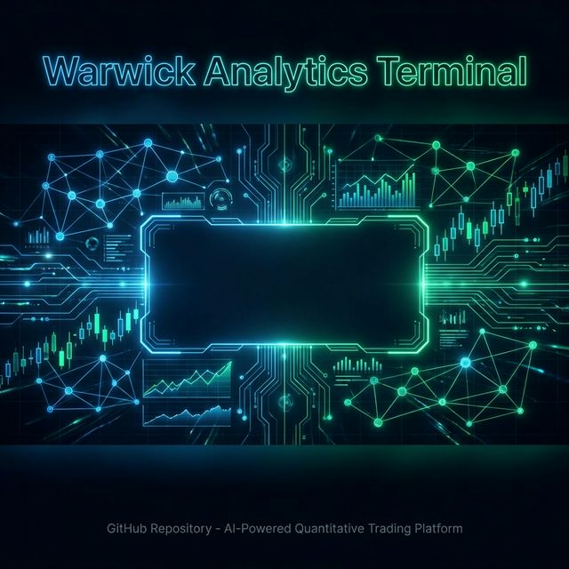

<div align="center">
  

  # ⚡ Warwick Analytics Terminal
  
  **Enterprise-Grade Equity Research M&A Dashboard powered by RAG, Llama-3.1, and Dynamic FAISS Indexing.**

  <p align="center">
    <a href="https://github.com/khushi2704rj-sephora/eq-analytics-terminal"></a>
    <a href="https://github.com/khushi2704rj-sephora/eq-analytics-terminal"></a>
    <a href="https://github.com/khushi2704rj-sephora/eq-analytics-terminal"></a>
    <a href="https://github.com/khushi2704rj-sephora/eq-analytics-terminal"></a>
    <a href="https://github.com/khushi2704rj-sephora/eq-analytics-terminal"></a>
  </p>
</div>

---

## 📖 Overview

The **Warwick Analytics Terminal** (V2 Enterprise) is a quantitative trading and equity research platform designed to bridge the gap between deterministic financial modeling and Generative AI. 

Instead of relying on static APIs, this terminal utilizes a **Dynamic Retrieval-Augmented Generation (RAG) pipeline** to ingest live SEC 10-K and Annual Report PDFs, vectorizes the semantic context via `sentence-transformers`, and leverages `Llama-3.1-8B-Instruct` to generate heavily structured institutional analyst briefs. 

These qualitative insights are then seamlessly injected into quantitative sandboxes, including a **Macroeconomic Shock Simulator** and an interactive **Discounted Cash Flow (DCF) intrinsic valuation modeler**.

---

## ✨ Enterprise Features

- **📄 Dynamic PDF Ingestion Engine:** Drag-and-drop SEC annual reports to instantly build an in-memory `FAISS` vector database. 
- **🧠 Pydantic-Structured LLM Synthesis:** Prevents standard "LLM drift" by strictly enforcing a `BaseModel` JSON schema for the generative output, ensuring consistent risk metrics and competitive scoring.
- **📉 Macroeconomic Shock Simulator:** Interactively adjust Interest Rate Deltas (bps) and Inflation Spikes (%) to see real-time estimated Market Cap variance on the target asset compared to a 30-company baseline universe.
- **💰 Real-Time DCF Modeler:** Override the baseline Free Cash Flow, Terminal Growth Rate (g), and WACC generated by the LLM to model out intrinsic valuations dynamically.
- **🖥️ Bloomberg-Style UI:** Custom CSS overlays transforming standard web elements into a dense, dark-mode terminal focused on high-density information architecture.

---

## 🛠️ Architecture Stack

* **Frontend:** Streamlit, Custom HTML/CSS Overlays, Plotly Graph Objects
* **Vector Store:** FAISS (Facebook AI Similarity Search)
* **Embeddings:** `all-MiniLM-L6-v2` via HuggingFace
* **LLM:** `Llama-3.1-8B-Instruct` (Novita Inference API)
* **Data Parsing:** `PyPDF2`, `langchain_text_splitters`

---

## 🚀 Installation & Local Deployment

To run this terminal locally, ensure you have Python 3.10+ installed and a valid HuggingFace Access Token.

**1. Clone the repository:**
```bash
git clone https://github.com/khushi2704rj-sephora/eq-analytics-terminal.git
cd eq-analytics-terminal
```

**2. Install dependencies:**
```bash
pip install -r requirements.txt
```

**3. Set your API Key and Launch:**
```bash
export HF_TOKEN="your_huggingface_write_token"
streamlit run app.py
```

---

<div align="center">
  <i>Developed as a Capstone Demonstrator for Advanced Business Analytics and AI.</i>
</div>
