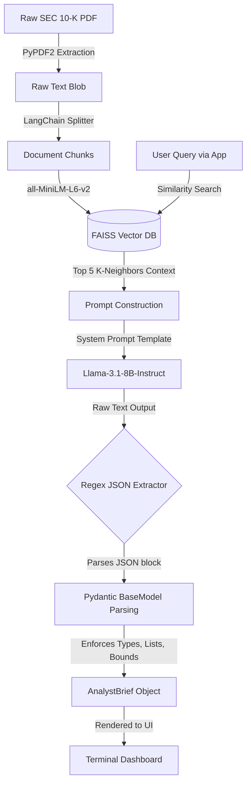

# 🏗️ Technical Architecture

This document outlines the system architecture of the **Nexus Equity Terminal (V2)**, detailing the data flow from unstructured PDF ingestion to structured LLM inference and UI rendering.

## 1. High-Level System Architecture

The application is built on a monolithic Streamlit backend that dynamically orchestrates external AI models and high-performance vector stores locally in memory.

### Layer Diagram

1. **Presentation Layer (UI):** Custom HTML/CSS injected into Streamlit to create a Bloomberg-style dark mode terminal. Employs Plotly Graph Objects for real-time visualization.
2. **Orchestration Layer:** Python 3.10 native processing. Manages session states, handles user inputs (sliders, drop-downs), and triggers backend pipelines.
3. **Retrieval-Augmented Generation (RAG) Engine:**
    - **Chunking:** `langchain_text_splitters` RecursiveCharacterTextSplitter chunks 100-page PDFs into 1000-character segments with 150-character overlap.
    - **Embedding:** `sentence-transformers/all-MiniLM-L6-v2` (Local execution via HuggingFaceEmbeddings).
    - **Vector Store:** `FAISS` running entirely in memory (CPU bound).
4. **Inference Layer (LLM):** `Llama-3.1-8B-Instruct` served via the Novita API endpoint using `huggingface_hub.InferenceClient`.

## 2. Data Pipeline: PDF to Structured Insights

The core innovation of the terminal is transforming unstructured corporate filings into a strict, programmatic JSON schema.

## 3. Quantitative Modeling Integration

The terminal leverages the qualitative LLM outputs (e.g., Base FCF, Estimated WACC, Terminal Growth Rate) as *seed inputs* for deterministic financial models.

- **DCF Simulator:** A programmatic loop calculates Present Value (PV) of future cash flows and Terminal Value (TV) based on real-time user slider adjustments, overriding the LLM seeds.
- **Macro-Universe Sensitivity:** The system maintains a baseline of 30 S&P 500 tech companies (loaded from `macro_universe.json`). By applying beta-like sensitivity multipliers to Interest Rates and Inflation, the system dynamically calculates market cap variance.
